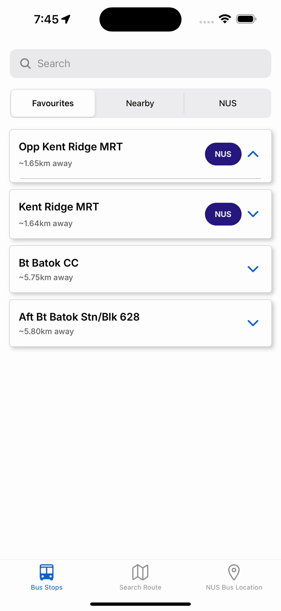

<!-- Improved compatibility of back to top link: See: https://github.com/othneildrew/Best-README-Template/pull/73 -->

<a id="readme-top"></a>

<!--
*** Thanks for checking out the Best-README-Template. If you have a suggestion
*** that would make this better, please fork the repo and create a pull request
*** or simply open an issue with the tag "enhancement".
*** Don't forget to give the project a star!
*** Thanks again! Now go create something AMAZING! :D
-->

<!-- PROJECT SHIELDS -->
<!--
*** I'm using markdown "reference style" links for readability.
*** Reference links are enclosed in brackets [ ] instead of parentheses ( ).
*** See the bottom of this document for the declaration of the reference variables
*** for contributors-url, forks-url, etc. This is an optional, concise syntax you may use.
*** https://www.markdownguide.org/basic-syntax/#reference-style-links
-->
<!-- [![Contributors][contributors-shield]][contributors-url
[![Forks][forks-shield]][forks-url]
[![Stargazers][stars-shield]][stars-url]
[![Issues][issues-shield]][issues-url]
[![MIT License][license-shield]][license-url] -->

[![LinkedIn][ly-linkedin-shield]][ly-linkedin-url]
[![LinkedIn][sr-linkedin-shield]][sr-linkedin-url]

<!-- PROJECT LOGO -->
<div align="center">
  <!-- <a href="https://github.com/othneildrew/Best-README-Template">
    
  </a> -->

  <h3 align="center">NUSMaps (Orbital 2024 Apollo 11)</h3>

  <p align="center">
    Effortlessly find routes and check bus arrival times, integrating NUS and public transport.
    <br />
    <a href="https://docs.google.com/document/d/1OixiEyLXQwfd-JoF3s_XRjfoQGEu8IjpKqIKieb5gWw/edit"><strong>Check out our docs! »</strong></a>
    <br />
    <a href="#expo-go-section"><strong>Try the app in Expo Go! »<strong></a>
  </p>
</div>

<!-- TABLE OF CONTENTS -->
<details>
  <summary>Table of Contents</summary>
  <ol>
    <li>
      <a href="#about-the-project">About The Project</a>
      <ul>
        <li><a href="#built-with">Built With</a></li>
      </ul>
    </li>
    <li>
      <a href="#getting-started">Getting Started</a>
      <ul>
        <li><a href="#prerequisites">Prerequisites</a></li>
        <li><a href="#installation">Installation</a></li>
      </ul>
    </li>
    <li><a href="#usage">Usage</a></li>
    <!-- <li><a href="#roadmap">Roadmap</a></li>
    <li><a href="#contributing">Contributing</a></li>
    <li><a href="#license">License</a></li>
    <li><a href="#contact">Contact</a></li> -->
    <li><a href="#acknowledgments">Acknowledgments</a></li>
  </ol>
</details>

<!-- ABOUT THE PROJECT -->

## About The Project

||||
|:-:|:-:|:-:|


NUSMaps was developed to address a common problem faced by NUS students:

- Finding optimal routes to and from NUS often involves a combination of NUS buses and public transport.
- The NUSNextBus app only provides routing within NUS using NUS buses.
- Google Maps only provides routing with public transport, excluding NUS bus routes.

The route finding algorithm in NUSMaps uses a weighted mix of LTA OneMap and NUS internal bus routes to provide comprehensive and efficient routing solutions.

For more information about our considerations and implementation details, check out our [Orbital writeup](https://docs.google.com/document/d/1OixiEyLXQwfd-JoF3s_XRjfoQGEu8IjpKqIKieb5gWw/edit)!

<p align="right">(<a href="#readme-top">back to top</a>)</p>

### Built With

[![React Native][ReactNative.js]][ReactNative-url]
[![Expo][Expo.js]][Expo-url]
[![Node.js][Node.js]][Node-url]
[![Express.js][Express.js]][Express-url]
[![TypeScript][TypeScript]][TypeScript-url]
[![PostgreSQL][PostgreSQL]][PostgreSQL-url]
[![Jest][Jest]][Jest-url]
[![Docker][Docker]][Docker-url]
[![GitHub Actions][GitHubActions]][GitHubActions-url]

<p align="right">(<a href="#readme-top">back to top</a>)</p>

<!-- GETTING STARTED -->

## Getting Started

<a id="expo-go-section"></a>

### Try out the app with minimal setup

1. **Download Expo Go** on your iOS/Android device.

2. **Scan the following QR code:** <br>


3. This will redirect you to NUSMaps in Expo Go. Enjoy! 🎉

### Setting up NUSMaps Application to run locally

### Prerequisites

- **API Authentication Key**: You will need to contact us to obtain the API authentication key required by our REST API.

- **npm**: Ensure you have the latest version of npm installed.
  ```sh
  npm install npm@latest -g
  ```
- **API Keys**
  - Request the API authentication key from one of the collaborators and enter it in the `.env` file.
  - Follow the setup instructions to enable the Places API and get your free Google Maps Platform API Key at [Google Maps Platform API](https://developers.google.com/maps/documentation/places/web-service/overview).
- **Device/Simulator**
  - **iOS**: Requires an iOS device or iOS Simulator installed on a macOS device.
  - **Android**: Requires an Android device or an [Android Emulator](https://developer.android.com/studio/run/emulator) installed.

### Installation

1. **Clone the repository:**
   ```sh
   git clone https://github.com/itsme-zeix/NUSMaps.git
   ```
2. **Navigate to the NUSMaps frontend directory:**
   ```sh
   cd YOUR_PATH_TO/NUSMaps/frontend
   ```
3. **Install NPM packages:**
   ```sh
   npm install
   ```
4. **Create a** `.env` **file** in the `/frontend` directory.

5. **Enter the API keys** obtained in the prerequisite step into the `.env` file:
   ```js
   EXPO_PUBLIC_GOOGLEMAPS_API_KEY = ENTER YOUR GOOGLE MAPS API KEY
   EXPO_PUBLIC_ONEMAPAPITOKEN = ENTER THE API AUTHENTICATION KEY
   ```
6. **Run the application** in the Expo environment. Follow the instructions provided to set up the environment on your preferred device. Note that the setup may vary depending on whether you are using iOS or Android (e.g., **`pod install`** may be required for iOS):
   ```sh
   npx expo start
   ```
7. The application will be launched on your device/emulator. Enjoy! 🎉

<p align="right">(<a href="#readme-top">back to top</a>)</p>

<!-- USAGE EXAMPLES
## Usage

Use this space to show useful examples of how a project can be used. Additional screenshots, code examples and demos work well in this space. You may also link to more resources.

_For more examples, please refer to the [Documentation](https://example.com)_

<p align="right">(<a href="#readme-top">back to top</a>)</p>
-->

<!-- ROADMAP
## Roadmap2

- [x] Add Changelog
- [x] Add back to top links
- [ ] Add Additional Templates w/ Examples
- [ ] Add "components" document to easily copy & paste sections of the readme
- [ ] Multi-language Support
    - [ ] Chinese
    - [ ] Spanish

See the [open issues](https://github.com/othneildrew/Best-README-Template/issues) for a full list of proposed features (and known issues).

<p align="right">(<a href="#readme-top">back to top</a>)</p>
-->

<!-- CONTRIBUTING
## Contributing

Contributions are what make the open source community such an amazing place to learn, inspire, and create. Any contributions you make are **greatly appreciated**.

If you have a suggestion that would make this better, please fork the repo and create a pull request. You can also simply open an issue with the tag "enhancement".
Don't forget to give the project a star! Thanks again!

1. Fork the Project
2. Create your Feature Branch (`git checkout -b feature/AmazingFeature`)
3. Commit your Changes (`git commit -m 'Add some AmazingFeature'`)
4. Push to the Branch (`git push origin feature/AmazingFeature`)
5. Open a Pull Request

<p align="right">(<a href="#readme-top">back to top</a>)</p>
-->

<!-- LICENSE
## License

Distributed under the MIT License. See `LICENSE.txt` for more information.

<p align="right">(<a href="#readme-top">back to top</a>)</p>
-->

<!-- CONTACT
## Contact

Your Name - [@your_twitter](https://twitter.com/your_username) - email@example.com

Project Link: [https://github.com/your_username/repo_name](https://github.com/your_username/repo_name)

<p align="right">(<a href="#readme-top">back to top</a>)</p>
-->

<!-- ACKNOWLEDGMENTS -->

## Acknowledgments

These free resources have helped tremendously in making NUSMaps possible.

- NUSNextBus API
- [Reverse Engineering of NUSNextBus API by Hu Jialun](https://github.com/SuibianP/nus-nextbus-new-api)
- [LTA OneMap API](https://www.onemap.gov.sg/)
- [LTA DataMall API](https://datamall.lta.gov.sg/content/datamall/en.html)
- [react-native-google-places-autocomplete](https://github.com/FaridSafi/react-native-google-places-autocomplete)
- [react-native-maps](https://github.com/react-native-maps/react-native-maps)

<p align="right">(<a href="#readme-top">back to top</a>)</p>

<!-- MARKDOWN LINKS & IMAGES -->
<!-- https://www.markdownguide.org/basic-syntax/#reference-style-links -->

[contributors-shield]: https://img.shields.io/github/contributors/othneildrew/Best-README-Template.svg?style=for-the-badge
[contributors-url]: https://github.com/ZShunRen
[forks-shield]: https://img.shields.io/github/forks/othneildrew/Best-README-Template.svg?style=for-the-badge
[forks-url]: https://github.com/othneildrew/Best-README-Template/network/members
[stars-shield]: https://img.shields.io/github/stars/othneildrew/Best-README-Template.svg?style=for-the-badge
[stars-url]: https://github.com/othneildrew/Best-README-Template/stargazers
[issues-shield]: https://img.shields.io/github/issues/othneildrew/Best-README-Template.svg?style=for-the-badge
[issues-url]: https://github.com/othneildrew/Best-README-Template/issues
[license-shield]: https://img.shields.io/github/license/othneildrew/Best-README-Template.svg?style=for-the-badge
[license-url]: https://github.com/othneildrew/Best-README-Template/blob/master/LICENSE.txt
[product-screenshot]: images/screenshot.png
[ReactNative.js]: https://img.shields.io/badge/react--native-20232A?style=for-the-badge&logo=react&logoColor=61DAFB
[ReactNative-url]: https://reactnative.dev/
[Expo.js]: https://img.shields.io/badge/expo-000020?style=for-the-badge&logo=expo&logoColor=white
[Expo-url]: https://expo.dev/
[Node.js]: https://img.shields.io/badge/Node.js-339933?style=for-the-badge&logo=node.js&logoColor=white
[Node-url]: https://nodejs.org/
[Express.js]: https://img.shields.io/badge/express.js-F7E02A?style=for-the-badge&logo=express&logoColor=000000
[Express-url]: https://expressjs.com/
[TypeScript]: https://img.shields.io/badge/TypeScript-3178C6?style=for-the-badge&logo=typescript&logoColor=white
[TypeScript-url]: https://www.typescriptlang.org/
[PostgreSQL]: https://img.shields.io/badge/PostgreSQL-4169E1?style=for-the-badge&logo=postgresql&logoColor=white
[PostgreSQL-url]: https://www.postgresql.org/
[Jest]: https://img.shields.io/badge/Jest-C21325?style=for-the-badge&logo=jest&logoColor=white
[Jest-url]: https://jestjs.io/
[Docker]: https://img.shields.io/badge/Docker-2496ED?style=for-the-badge&logo=docker&logoColor=white
[Docker-url]: https://www.docker.com/
[GitHubActions]: https://img.shields.io/badge/GitHub%20Actions-2088FF?style=for-the-badge&logo=github%20actions&logoColor=white
[GitHubActions-url]: https://github.com/features/actions
[ly-linkedin-shield]: https://img.shields.io/badge/-LeYew-black.svg?style=for-the-badge&logo=linkedin&colorB=004182
[ly-linkedin-url]: https://www.linkedin.com/in/leyewtan/
[sr-linkedin-shield]: https://img.shields.io/badge/-ShunRen-black.svg?style=for-the-badge&logo=linkedin&colorB=004182
[sr-linkedin-url]: https://www.linkedin.com/in/zheng-shun-ren-43b919249/
